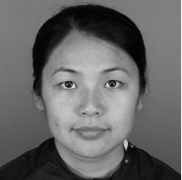
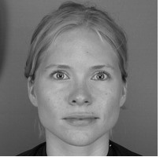
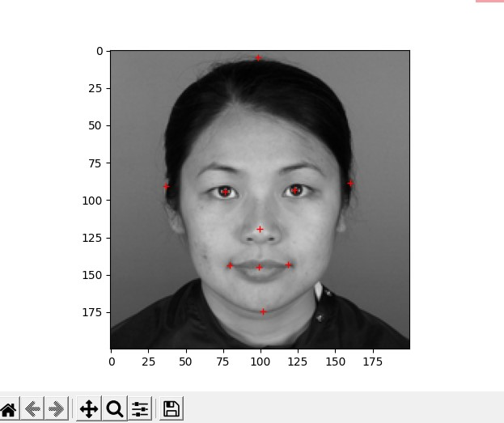
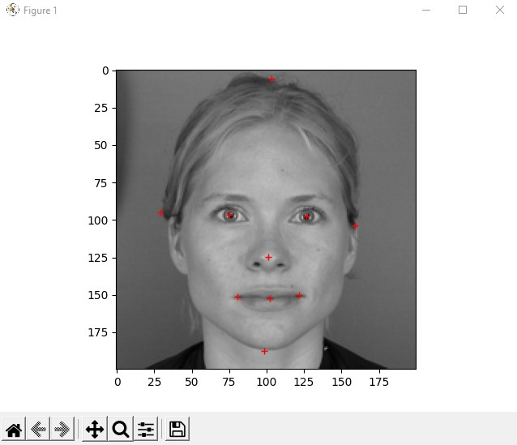

so let's take a look at these two images:




Given these two pictures of faces, this project creates a sequence of images that shows morphing from one face image to the other.

in order to do that, we first need to choose a certein amount of points on each face so that each point we chose on the first face, will be mapped to the coresponding point on the second face.

let's demonstrare:

we are choosing key points, we want to map from one face to another:



so we choose the eyes, ears, lips and everyting we want to map smoothly.

afer we chose the right points to map, this is the result of our cross-dissolving:


to run this code localy, after cloning the project, run the commaneds:
```
pip install numpy
pip install opencv-python
pip install matplotlib

````
and run the project.
the points that are marked at the example above will be inserted automatically.
after running, a new file named ***"Example video"*** will be created and saved at the folder of the project.


